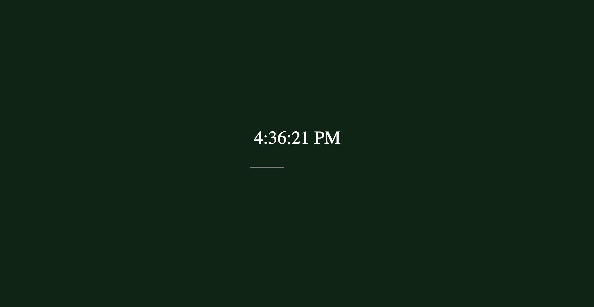

## Color clock
This assignment had us design a clock that kept the current time but also changed the back ground every second and tie it to the current time.

We also had to have it set the current Hex time when you mouse over it and the current time when you leave it.

#### Challenges
Some of the challenges for this project was trying to get the time to display with letters and numbers. You have to change the the ***.toString()*** method with an argument of ***16*** in it for you to be able to display a Hex clock when the mouse hovers over the clock

It can be found here: [color-clock]

[color-clock]: https://mikestegall.github.io/color-clock/
